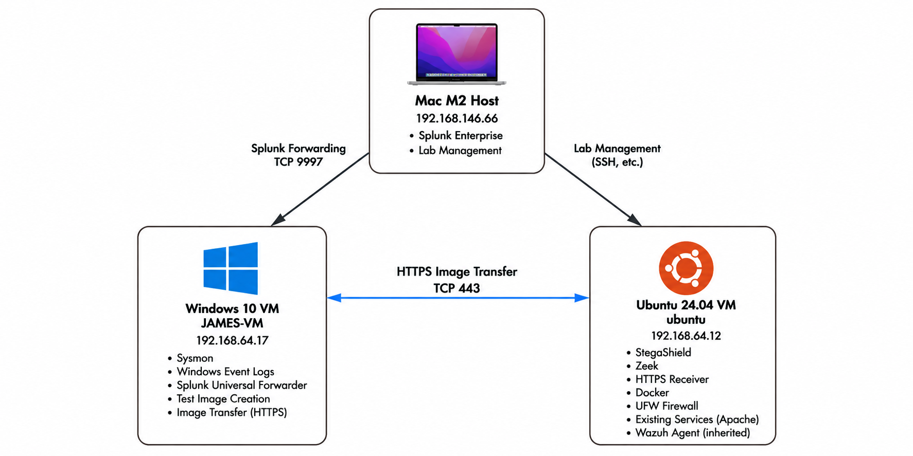

# StegaShield Detection Validation Pilot

## Overview

This repository is the master hub for my seven day StegaShield detection validation pilot.

I built this pilot to answer one main question:

**Can StegaShield distinguish known clean images from images I intentionally modify using steganography?**

The goal is not simply to make the product generate an alert.

I want to understand what the model detects, where it performs well, where it does not, and how useful its signal becomes when investigated alongside endpoint, network, application, and content evidence.

Each day of the pilot focuses on a different stage of the investigation and will be documented in its own repository.

As each investigation is completed, its repository will be linked from this master project.

---

## Why I Built This

A network connection can show that an image was transferred.

That does not prove the image contains hidden data.

A detection alert can show that something looks suspicious.

That does not automatically prove data exfiltration occurred.

This distinction is what I want to investigate.

My previous image transfer testing showed me the difference between seeing activity and actually understanding what that activity means.

In that lab, network telemetry could show an image transfer, and a rule could identify a marker that I already knew existed.

That was useful visibility, but it was not the same as detecting unknown hidden content.

This pilot takes the investigation one layer deeper by evaluating a content aware detection signal and then correlating that signal with the surrounding SOC evidence.

---

## Research Question

The primary research question is:

**Can StegaShield distinguish known clean images from images intentionally modified using steganography under controlled conditions?**

The pilot will also investigate:

* How probability scores differ between clean and modified images
* Correct and incorrect classifications
* False positives and false negatives
* Repeatability across controlled tests
* Behaviour outside the model's stated training scope
* Whether surrounding telemetry improves analyst confidence
* What the available evidence can and cannot prove

---

## Lab Architecture



The pilot uses my existing M2 Mac home lab.

The architecture separates endpoint activity, server side processing, network visibility, content analysis, and SOC correlation.

Some components shown in the architecture are part of the planned pilot environment and will be introduced during later stages of the investigation.

### Windows Endpoint

The Windows VM represents the simulated corporate endpoint.

It is used to store and transfer controlled image samples and provides endpoint telemetry through Sysmon and Windows event logs.

### Ubuntu Server

Ubuntu 24.04 provides the controlled server environment.

The planned investigation environment includes:

* HTTPS receiver
* StegaShield
* Zeek

These components are introduced and validated during the appropriate stages of the pilot rather than being treated as part of the original Day 1 baseline.

### Mac M2

The Mac hosts the existing lab environment and Splunk Enterprise.

Splunk is used as the central SOC investigation platform for correlating evidence from the different layers of the pilot.

---

## Investigation Flow

```text
Windows Activity
      |
      v
Endpoint Telemetry
      |
      v
HTTPS Transfer
      |
      v
Network Telemetry
      |
      v
Received Image
      |
      v
StegaShield Analysis
      |
      v
Splunk Correlation
      |
      v
Analyst Interpretation
```

Each layer answers a different question.

No individual signal will be treated as proof of exfiltration by itself.

---

## Ground Truth Principle

Ground truth is established before an image is submitted to StegaShield.

StegaShield does not decide whether my test sample is clean or intentionally modified.

I establish that independently.

Each controlled sample will be documented with information such as:

* Test ID
* Parent image
* Filename
* Ground truth
* SHA256 hash
* File format
* Dimensions
* File size
* Image source
* Embedding method
* Payload preparation
* Payload size
* Tool and version
* StegaShield analysis ID
* Probability score
* Classification
* Timestamp
* Analyst notes

This allows the model's result to be compared against a known sample rather than using the model itself to define the answer.

---

## Validation Scope

The primary validation focuses on Least Significant Bit steganography because this is the stated training scope for the model being evaluated.

The investigation begins with known clean controls and controlled LSB samples.

Additional techniques may later be tested separately to explore behaviour outside the stated training distribution.

Those results will be treated as generalization testing rather than equivalent to the primary LSB validation.

A detection outside the stated training scope will not automatically be interpreted as proof that the model detects steganography generally.

Likewise, a missed technique outside that scope will not automatically be treated as a product failure.

---

## Investigation Method

I am using the same investigation process I have been developing throughout my SOC lab work:

```text
Baseline
Controlled Activity
Expected Telemetry
Actual Telemetry
Hypothesis
Triage
Investigation
Correlation
Interpretation
Evidence Gaps
Disposition
Detection Review
Tuning
Variation
Repeat
```

Throughout the pilot, I separate four levels of analysis.

### Observed

What the evidence directly shows.

### Correlated

What becomes visible when multiple evidence sources are connected.

### Interpretation

What I believe the combined evidence means.

### Unknown

What the available evidence cannot establish.

This separation is important because analyst conclusions should not exceed what the evidence can actually support.

---

## Evidence Approach

Each completed investigation will include genuine evidence collected from the lab.

Screenshots are used to support technical claims rather than as decoration.

Evidence will be selected based on whether it proves an important investigation stage, such as:

* Baseline state
* Controlled activity
* Telemetry generation
* Detection output
* Correlation
* Troubleshooting
* Verification
* Unexpected behaviour
* Final findings

Each Day repository will contain enough evidence to make the investigation reproducible and understandable without filling the repository with redundant screenshots.

---

# Pilot Plan

### [Day 1: Environment Baseline](https://github.com/WiLL75G/stegashield-day-01-environment-baseline)

Establish the state of the environment before introducing the pilot components.

The baseline covers Windows, Ubuntu, Mac, Splunk, Sysmon, Docker, firewall configuration, existing services, background activity, system time, and network connectivity.

The purpose is to understand what already exists so later activity is not incorrectly attributed to StegaShield testing.

### [Day 2: Dataset and Ground Truth](ACTUAL-DAY-2-REPOSITORY-URL)

Prepare the controlled image dataset and establish independent ground truth.

Each sample will receive a known identity before StegaShield analyzes it.

This creates the foundation required to evaluate correct classifications, incorrect classifications, false positives, and false negatives.

### [Day 3: StegaShield and Clean Baseline](ACTUAL-DAY-3-REPOSITORY-URL)

Deploy StegaShield and begin with known clean images.

The objective is to understand how the model behaves against clean controls before introducing intentionally modified samples.

This provides a clean image scoring baseline for later comparison.

### [Day 4: LSB Validation](ACTUAL-DAY-4-REPOSITORY-URL)

Introduce controlled Least Significant Bit steganography samples.

Known clean images will be compared with their intentionally modified counterparts.

Probability scores, classifications, repeatability, and differences between the samples will be documented.

### [Day 5: Error Analysis and Generalization](ACTUAL-DAY-5-REPOSITORY-URL)

Investigate incorrect classifications and unusual results.

This stage will examine false positives, false negatives, repeatability, and possible patterns in incorrectly scored images.

Testing outside the stated LSB training scope may also be introduced separately to explore model generalization.

### [Day 6: HTTPS and SOC Investigation](ACTUAL-DAY-6-REPOSITORY-URL)

Move from isolated content testing into a controlled SOC investigation.

The HTTPS transfer path will be introduced and evidence will be correlated across the available layers.

The objective is to understand what an analyst can establish when endpoint, network, application, and StegaShield evidence are investigated together.

### [Day 7: Reproduction and Findings](ACTUAL-DAY-7-REPOSITORY-URL)

Reproduce important findings and review the complete evidence chain.

This stage will document limitations, evidence gaps, important observations, configuration considerations, and final conclusions.

The findings will distinguish what was directly observed from what can reasonably be interpreted from the evidence.

---

## What I Am Not Claiming

A high StegaShield probability does not automatically prove malicious activity.

An image upload does not automatically prove steganography.

Steganography does not automatically prove data exfiltration.

Network visibility does not automatically provide content visibility.

A missed technique outside the model's stated training distribution does not automatically mean the product failed.

A successful detection outside that scope does not automatically prove general steganography detection capability.

The final conclusions will be based on the evidence collected during the pilot.

---

## Project Repositories

Completed investigations will be linked here.

| Day | Investigation | Repository | Status |
| --- | --- | --- | --- |
| Day 1 | Environment Baseline | [View Repository](https://github.com/WiLL75G/stegashield-day-01-environment-baseline) | Complete |
| Day 2 | Dataset and Ground Truth | Link added after completion | Pending |
| Day 3 | StegaShield and Clean Baseline | Link added after completion | Pending |
| Day 4 | LSB Validation | Link added after completion | Pending |
| Day 5 | Error Analysis and Generalization | Link added after completion | Pending |
| Day 6 | HTTPS and SOC Investigation | Link added after completion | Pending |
| Day 7 | Reproduction and Findings | Link added after completion | Pending |

---

## Status

**Pilot in progress**

The master repository will only be updated with a Day repository link after that investigation, its evidence, and its documentation are complete and verified.

---

## Core Principle

**Telemetry is not detection, and detection is not automatically proof of malicious activity.**

My role as the analyst is to understand what each source can prove, correlate the available evidence, identify what remains unknown, and make a defensible conclusion.
